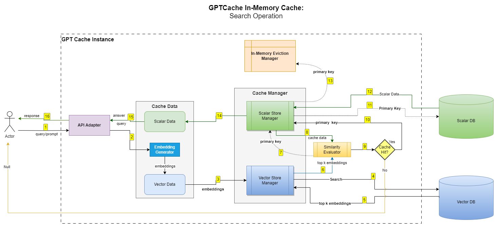
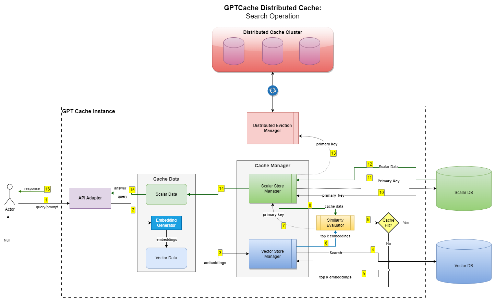
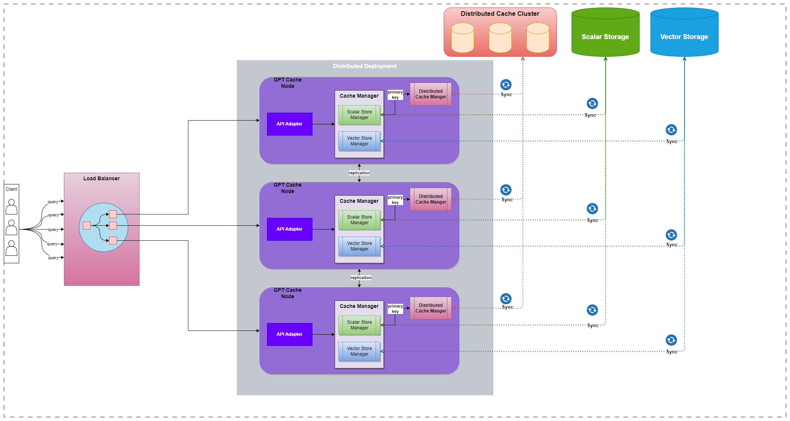

# MAQCache Usage Guide

MAQCache sits between your application and an LLM provider. Before a
prompt is sent to the model, MAQCache checks whether a semantically
similar prompt has already been answered; if so, it returns the stored
answer instead of paying for another model call. Everything below
covers how the pieces fit together and how to configure them.

## How a request flows through the cache

1. **Accept the request.** The adapter layer normalizes whatever LLM
   client call you're making (OpenAI, Anthropic, LangChain, ...) into a
   common request shape.
2. **Turn the prompt into a vector.** A pre-processing function pulls
   the relevant text out of the request, and an embedding function
   converts it into a dense vector.
3. **Search for a similar vector.** The vector store returns the
   closest matches it has on file.
4. **Score the match.** A similarity evaluator decides whether any of
   those candidates are close enough to count as a hit.
5. **Fetch or store.** On a hit, the stored answer (held in the scalar
   store, alongside the vector's cache key) is returned. On a miss,
   the request goes to the real LLM and the new question/answer pair
   is written back to the cache.



By default, step 5's bookkeeping (which cache keys exist, which are
due for eviction) lives in a single process's memory. That's fine for
one node, but it means two replicas of your service won't share a
cache. Swapping the eviction manager for a shared store (Redis) moves
that bookkeeping out of process memory so every node sees the same
cache state:



With a shared eviction manager in place, you can run MAQCache behind a
load balancer across multiple nodes and they'll all hit the same
cache:



```python
from maqcache import Cache
from maqcache.embedding import Onnx
from maqcache.manager import manager_factory

onnx = Onnx()
data_manager = manager_factory(
    "redis,faiss",
    eviction_manager="redis",
    scalar_params={"url": "redis://localhost:6379"},
    vector_params={"dimension": onnx.dimension},
    eviction_params={"maxmemory": "100mb", "policy": "allkeys-lru", "ttl": 1},
)

cache = Cache()
cache.init(data_manager=data_manager)
```

The server (see below) accepts the same options through a YAML config
file instead of Python kwargs.

## Building a cache

Every cache is assembled from the same set of interchangeable pieces,
each with a sensible default:

```python
class Cache:
    def init(self,
             cache_enable_func=cache_all,
             pre_embedding_func=last_content,
             embedding_func=string_embedding,
             data_manager=get_data_manager(),
             similarity_evaluation=ExactMatchEvaluation(),
             post_process_messages_func=first,
             config=Config(),
             next_cache=None,
             **kwargs):
        ...
```

- **`pre_embedding_func`** pulls the text worth embedding out of the
  raw request. Different LLM clients shape their requests differently,
  so pick the one that matches yours (see `maqcache/processor/pre.py`
  for the full list — options exist for OpenAI chat/image/audio,
  LangChain, Replicate, Stable Diffusion, MiniGPT4, Dolly, and more).
  For long conversations, `maqcache/processor/context/` has
  summarization- and selection-based compressors that shrink a chat
  history down before it's embedded.
- **`embedding_func`** turns that text into a vector. Built-in
  backends (`maqcache/embedding/`) cover ONNX, Huggingface
  Transformers, Sentence-Transformers, OpenAI, Cohere, LangChain,
  RWKV, PaddleNLP, UForm, FastText, Data2Vec (audio), Timm and ViT
  (image). Pick one based on the modality you're caching and the
  language(s) your traffic uses.
- **`data_manager`** owns both the scalar store (original
  prompts/answers/metadata — SQLite, MySQL, MariaDB, SQL Server,
  Oracle, PostgreSQL, DuckDB) and the vector store (FAISS, Milvus,
  Chroma, hnswlib, pgvector, DocArray, USearch, Redis). For
  multi-modal caches there's also an object store (local disk or S3)
  for the raw files.

  ```python
  from maqcache.manager import manager_factory

  data_manager = manager_factory(
      "sqlite,faiss", data_dir="./workspace",
      scalar_params={}, vector_params={"dimension": 128},
  )
  ```

  or compose the pieces directly:

  ```python
  from maqcache.manager import get_data_manager, CacheBase, VectorBase

  data_manager = get_data_manager(CacheBase("sqlite"), VectorBase("faiss", dimension=128))
  ```
- **`similarity_evaluation`** decides whether a candidate match is
  close enough to serve. Options range from exact string matching, to
  raw embedding distance, to a dedicated ONNX cross-encoder model for
  higher-precision judgments.
- **`post_process_messages_func`** picks which cached candidate (or
  combination of candidates) is actually returned to the caller.
- **`config`** holds tunables like `similarity_threshold`.
- **`next_cache`** chains caches together (e.g. a fast in-memory L1 in
  front of a larger L2); a miss on the first falls through to the
  next before finally calling the LLM.

The library also ships two shortcuts that wire up a sensible default
stack for you instead of building one by hand:

- `init_similar_cache(data_dir=..., pre_func=get_prompt, ...)` — an
  ONNX + SQLite + FAISS similarity cache.
- `init_similar_cache_from_config(config_dir=...)` — builds the same
  kind of cache from a YAML config file (see
  `cache_config_template.yml` for the shape).

## Talking to an LLM through the cache

**MAQ SLM adapter** — MAQ Softwares' internal OpenAI-compatible LLM
gateway. Set `MAQ_SLM_API_KEY` (and optionally `MAQ_SLM_BASE_URL` if
you're not using the default gateway) in your environment, then:

```python
from maqcache import cache
from maqcache.adapter import maq_slm

cache.init()

response = maq_slm.ChatCompletion.create(
    model="qwen-3.8-27b",
    messages=[{"role": "user", "content": "what's github"}],
)
answer = response.choices[0].message.content
```

This adapter is a thin subclass of the modern OpenAI-client adapter
below — any OpenAI-compatible endpoint can be wired up the same way by
overriding `_sync_client`/`_async_client` with your own `base_url`.

**OpenAI adapter:**

```python
from maqcache import cache
from maqcache.adapter import openai

cache.init()
cache.set_openai_key()

response = openai.ChatCompletion.create(
    model="gpt-3.5-turbo",
    messages=[{"role": "user", "content": "what's github"}],
)
```

Streaming responses work the same way — pass `stream=True` and
consume the returned generator as you normally would with the OpenAI
SDK.

**LangChain adapter**, for any LLM LangChain supports:

```python
from maqcache import Cache
from maqcache.adapter.langchain_models import LangChainLLMs
from maqcache.processor.pre import get_prompt
from langchain.llms import OpenAI
from langchain import PromptTemplate

llm_cache = Cache()
llm_cache.init(pre_embedding_func=get_prompt)

cached_llm = LangChainLLMs(OpenAI())
answer = cached_llm("What NFL team won the Super Bowl the year Justin Bieber was born?", cache_obj=llm_cache)
```

There's also a direct Anthropic adapter (`maqcache.adapter.anthropic`)
for Claude models, and adapters for Replicate, Stability AI,
diffusers, MiniGPT4, Llama.cpp, and Dolly under `maqcache/adapter/`.

### Per-request options

- **`cache_obj`** — pass a specific `Cache` instance instead of using
  the global default, useful when a service needs several
  independently-configured caches.
- **`cache_context`** — override individual pipeline functions
  (`pre_embedding_func`, `embedding_func`, etc.) for just one call.
- **`cache_skip=True`** — bypass the cache lookup but still write the
  LLM's answer back into it.
- **`session=Session(name=...)`** — scope cache hits to a session, see
  `maqcache/session.py`.
- **`temperature`** — MAQCache maps the standard `temperature`
  parameter onto cache behavior: `0` always checks the cache first,
  `2` always calls the LLM directly, and values in between
  probabilistically skip the cache more often as temperature rises
  (via `post_process_messages_func=temperature_softmax`).

## Running MAQCache as a server

MAQCache can run standalone as an HTTP service instead of being
embedded in your application process.

**Start it directly:**

```shell
$ maqcache_server -s 127.0.0.1 -p 8000
```

**Or build and run it in a container:**

```shell
$ docker build -t maqcache -f maqcache_server/dockerfiles/Dockerfile .
$ docker run -p 8000:8000 -it maqcache
```

**Talk to it over HTTP:**

```shell
curl -X POST http://localhost:8000/put \
  -H 'Content-Type: application/json' \
  -d '{"prompt": "Hi", "answer": "Hi back"}'

curl -X POST http://localhost:8000/get \
  -H 'Content-Type: application/json' \
  -d '{"prompt": "Hi"}'
```

**Or through the bundled Python client:**

```python
from maqcache.client import Client

client = Client(uri="http://localhost:8000")
client.put("Hi", "Hi back")
client.get("Hi")  # -> 'Hi back'
```

For more end-to-end examples (per-adapter, per-embedding-backend, and
per-similarity-evaluator), see [examples/README.md](../examples/README.md).
